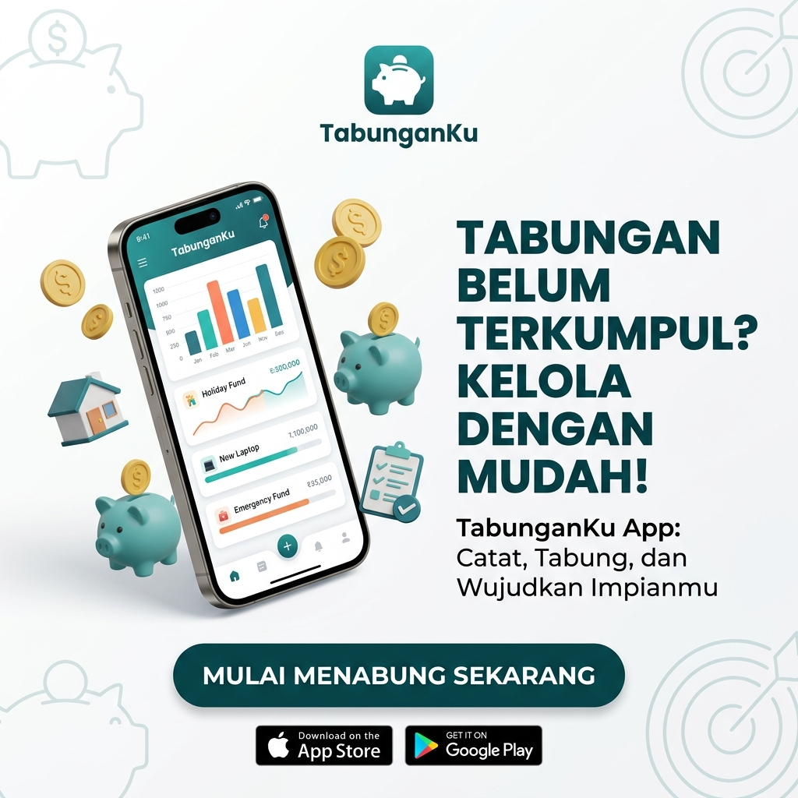

# 💰 TabunganKu - Aplikasi Tabungan Keluarga Cerdas

[](https://flutter.dev)
[](https://riverpod.dev)
[](https://firebase.google.com)
[](LICENSE)



**TabunganKu** adalah ekosistem manajemen keuangan modern yang dirancang untuk menghadirkan transparansi dan kebiasaan menabung yang sehat bagi keluarga Indonesia. Dengan pendekatan **Premium UI/UX (Stellar Sky Design)** dan integrasi cloud yang cerdas, kami mengubah cara Anda mengelola masa depan finansial Anda.

---

## ✨ Fitur Unggulan

TabunganKu bukan sekadar catatan pengeluaran. Ini adalah asisten keuangan pribadi lengkap yang mencakup:

### 🏠 Inti Keuangan
- **📊 Dashboard Interaktif**: Pantau sisa saldo, pendapatan, dan pengeluaran harian dengan grafik elegan bertenaga **FL Chart**.
- **👨‍👩‍👧‍👦 Grup Keluarga**: Sinkronkan catatan tabungan dengan seluruh anggota keluarga secara real-time melalui **Firebase Firestore**.
- **📈 Progres Target**: Visualisasikan seberapa dekat Anda dengan impian (iPhone, Rumah, Liburan) dengan indikator progres yang dinamis.

### 🎮 Gamifikasi & Kebiasaan
- **🎯 Saving Challenges**: 14+ template tantangan menabung (Harian, Mingguan, Bulanan) untuk membangun disiplin.
- **🏆 Badge Collection**: Kumpulkan lencana eksklusif berdasarkan streak menabung, total tabungan, dan penyelesaian tantangan.
- **🔥 Streak Tracker**: Pertahankan konsistensi menabung Anda dengan penghitung hari berturut-turut.

### 🛠️ Alat Cerdas
- **📷 Scan Bukti (OCR)**: Catat transaksi otomatis hanya dengan memotret struk menggunakan bantuan **Google ML Kit**.
- **🧮 Smart Calculator**: Akselerasi perhitungan keuangan langsung di dalam aplikasi.
- **🏠 Simulasi & Alokasi**: Gunakan simulator 50/30/20 untuk merencanakan keuangan masa depan Anda.
- **📄 Laporan PDF**: Ekspor riwayat transaksi lengkap ke format PDF berkualitas tinggi untuk arsip fisik.

---

## 🛠️ Stack Teknologi Modern

Aplikasi ini dibangun menggunakan praktik terbaik di industri Flutter:

| Layer | Teknologi | Deskripsi |
| :--- | :--- | :--- |
| **Core Framework** | **Flutter 3.0+ (Dart)** | Performa native untuk Android & iOS. |
| **State Management** | **Riverpod** | Manajemen state yang aman dan testable. |
| **Backend / Ops** | **Firebase** | Firestore, Cloud Storage, & Auth. |
| **AI / Machine Learning** | **Google ML Kit** | Pengenalan teks otomatis untuk scan struk. |
| **Routing** | **GoRouter** | Navigasi deklaratif yang modern. |
| **UI Components** | **Custom Stellar Sky** | Desain kustom dengan Poppins & Comic Neue fonts. |
| **Graphics** | **FL Chart** | Visualisasi data keuangan yang interaktif. |

---

## 🚀 Memulai (Developer Setup)

> [!IMPORTANT]
> Proyek ini memerlukan konfigurasi Firebase untuk sinkronisasi cloud agar berfungsi sepenuhnya.

### Prasyarat
- **Flutter SDK** (v3.0.0 atau lebih tinggi)
- **Dart SDK** (v3.0.0 atau lebih tinggi)
- Akun **Firebase Console**

### Langkah Instalasi

1.  **Clone & Fetch**
    ```bash
    git clone https://github.com/MuhammadIsakiPrananda1/tabunganku-mobile.git
    cd tabunganku-mobile
    flutter pub get
    ```

2.  **Konfigurasi Firebase**
    - Buat proyek di [Firebase Console](https://console.firebase.google.com).
    - Tambahkan aplikasi Android/iOS.
    - Unduh dan letakkan file konfigurasi:
        - Android: `android/app/google-services.json`
        - iOS: `ios/Runner/GoogleService-Info.plist`

3.  **Generate Models (Jika perlu)**
    ```bash
    flutter pub run build_runner build --delete-conflicting-outputs
    ```

4.  **Jalankan Aplikasi**
    ```bash
    flutter run
    ```

---

## 🏗️ Build & Deployment

### Produksi Android
Gunakan perintah berikut untuk membuat file APK yang dioptimalkan:
```bash
flutter build apk --split-per-abi --release
```

### Produksi iOS
```bash
flutter build ipa --release
```

---

## 📄 Lisensi & Kredit

Proyek ini dikembangkan oleh **Muhammad Isaki Prananda** dan didisribusikan di bawah **MIT License**.

- **Pengembang Utama**: [Muhammad Isaki Prananda](https://github.com/MuhammadIsakiPrananda1)
- **Dibuat dengan**: ❤️ Flutter, Riverpod, & Google Firebase.

---
© 2026 Neverland Studio. Hak Cipta Dilindungi Undang-Undang.
