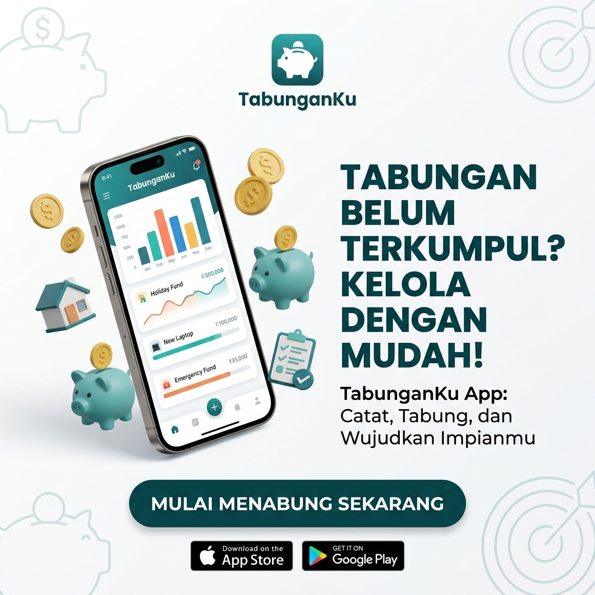

# 💰 TabunganKu

<p align="center">
  
</p>

<p align="center">
  <a href="#-fitur-fitur-unggulan"></a>
  <a href="https://flutter.dev"></a>
  <a href="https://dart.dev"></a>
  <a href="https://riverpod.dev"></a>
  
  
  <a href="LICENSE"></a>
</p>

---

## 📑 Daftar Isi

- [💡 Apa Sih TabunganKu Itu?](#-apa-sih-tabunganku-itu)
- [✨ Fitur-Fitur Unggulan](#-fitur-fitur-unggulan)
  - [1. 💳 Manajemen Arus Kas & Transaksi](#1--manajemen-arus-kas--transaksi)
  - [2. 🎯 Target Tabungan & Dana Rencana](#2--target-tabungan--dana-rencana)
  - [3. 🪙 Nabung Receh & Gamifikasi Finansial](#3--nabung-receh--gamifikasi-finansial)
  - [4. 👥 Nabung Bersama (Group Savings)](#4--nabung-bersama-group-savings)
  - [5. 💼 Portofolio Aset & Investasi](#5--portofolio-aset--investasi)
  - [6. 🧮 Suite Kalkulator Finansial Lengkap](#6--suite-kalkulator-finansial-lengkap)
  - [7. 🛒 Smart Shopping List & Anggaran Belanja](#7--smart-shopping-list--anggaran-belanja)
  - [8. 🔒 Keamanan & Privasi Tingkat Militer](#8--keamanan--privasi-tingkat-militer)
  - [9. 📊 Visualisasi Grafik & Laporan](#9--visualisasi-grafik--laporan)
- [🧰 Bahan-Bahan & Kebutuhan Sistem (Prerequisites)](#-bahan-bahan--kebutuhan-sistem-prerequisites)
  - [Persyaratan Perangkat Lunak (Software Tools)](#persyaratan-perangkat-lunak-software-tools)
  - [Stack Teknologi & Pustaka Utama (Dependencies)](#stack-teknologi--pustaka-utama-dependencies)
- [🚀 Panduan Deploy & Menjalankan di Localhost](#-panduan-deploy--menjalankan-di-localhost)
  - [Langkah 1: Klon Repositori](#langkah-1-klon-repositori)
  - [Langkah 2: Verifikasi Lingkungan Pengembangan](#langkah-2-verifikasi-lingkungan-pengembangan)
  - [Langkah 3: Unduh Paket & Dependensi](#langkah-3-unduh-paket--dependensi)
  - [Langkah 4: Jalankan Code Generator (Build Runner)](#langkah-4-jalankan-code-generator-build-runner)
  - [Langkah 5: Periksa Daftar Perangkat (Device)](#langkah-5-periksa-daftar-perangkat-device)
  - [Langkah 6: Jalankan Aplikasi di Localhost](#langkah-6-jalankan-aplikasi-di-localhost)
  - [Langkah 7: Hot Reload & Hot Restart Saat Development](#langkah-7-hot-reload--hot-restart-saat-development)
  - [Langkah 8: Build Lokal untuk Produksi (Release)](#langkah-8-build-lokal-untuk-produksi-release)
- [📂 Struktur Arsitektur Direktori](#-struktur-arsitektur-direktori)
- [🛠️ Tips Pemecahan Masalah (Troubleshooting)](#️-tips-pemecahan-masalah-troubleshooting)
- [📄 Lisensi & Pengembang](#-lisensi--pengembang)

---

## 💡 Apa Sih TabunganKu Itu?

**TabunganKu** adalah aplikasi manajemen finansial pribadi dan keluarga generasi modern yang dirancang untuk membantu siapa saja mencapai kebebasan finansial (*financial freedom*) dengan cara yang teratur, cerdas, menyenangkan, dan **100% berorientasi pada privasi (Zero-Telemetry & 100% Offline-First)**.

> 💬 *"Mengelola uang tidak boleh menjadi beban yang rumit atau mengorbankan privasi Anda. TabunganKu mengembalikan kendali penuh atas data kekayaan Anda langsung ke genggaman tangan Anda sendiri."*

### Mengapa TabunganKu Berbeda?

1. **Kedaulatan Data Penuh (Zero Cloud Financial Leak)**:  
   Banyak aplikasi finansial mewajibkan login akun online dan mengunggah rincian saldo serta mutasi Anda ke server internet mereka. Di **TabunganKu**, seluruh catatan pemasukan, pengeluaran, hutang, target tabungan, dan aset tersimpan **100% secara lokal** di dalam memori penyimpanan perangkat Anda. Tidak ada pihak ketiga yang dapat mengintip uang Anda.
2. **Keamanan Setara Perangkat Keras**:  
   Kredensial sensitif seperti PIN dan hash lisensi dienkripsi dengan standar militer **AES-256-GCM** yang dilindungi oleh modul keamanan hardware bawaan ponsel (*Android Keystore* dan *iOS Keychain*).
3. **Ekosistem Finansial All-in-One**:  
   Bukan sekadar buku kas biasa, TabunganKu memadukan pencatatan mutasi kas, simulasi emas fisik Antam, konversi valas live, celengan receh otomatis (*round-up savings*), gamifikasi *streak* harian, 14+ tantangan menabung, hingga kalkulator finansial mutakhir (bunga berbunga, KPR, pajak gaji bersih PPh 21, dan zakat).
4. **Desain Elegan & Responsif**:  
   Dibangun dengan Flutter, antarmuka TabunganKu tampil memukau dengan transisi halus, tipografi elegan (Inter, Quicksand, Plus Jakarta Sans), dukungan tema gelap/terang, dan grafik visual interaktif.

---

## ✨ Fitur-Fitur Unggulan

Berikut adalah rincian fitur lengkap yang siap digunakan di TabunganKu:

### 1. 💳 Manajemen Arus Kas & Transaksi

* **Pencatatan Cepat & Multi-Kategori**: Catat transaksi pemasukan dan pengeluaran dengan ribuan opsi kategori, ikon representatif, dan *cache instant search* $O(1)$.
- **Transaksi Berulang (Recurring Bills & Income)**: Otomatisasi pencatatan gaji bulanan, langganan internet, tagihan listrik, sewa tempat, dan tagihan berkala.
- **Riwayat & Filter Lengkap**: Telusuri jejak mutasi dengan filter rentang tanggal dinamis, jenis kategori, serta pencarian kata kunci.
- **Smart Calculator Sheet**: Papan hitung kalkulator built-in yang langsung dapat dipakai saat memasukkan nominal transaksi tanpa perlu keluar aplikasi.
- **Scan & Lampiran Struk**: Dukungan penyimpanan bukti struk transaksi dengan pemotongan foto (*image cropper*) dan kompresi WebP.

### 2. 🎯 Target Tabungan & Dana Rencana

* **Saving Goals Mandiri**: Tentukan target dana impian (misal: Beli Laptop Baru, Liburan, Dana Menikah, Rumah Impian) lengkap dengan target nominal dan tenggat waktu (*deadline*).
- **Simulasi Proyeksi Setoran**: Rekomendasi nominal setoran harian/mingguan/bulanan agar target tercapai tepat waktu.
- **Brankas Gajian (Payday Vault)**: Pisahkan pos gaji utama ke brankas tabungan terkunci sesaat setelah tanggal gajian tiba agar tidak terpakai untuk belanja konsumtif.

### 3. 🪙 Nabung Receh & Gamifikasi Finansial

* **Round-Up Savings (Nabung Receh Otomatis)**: Fitur pembulatan transaksi pengeluaran ke kelipatan terdekat (Rp 1.000, Rp 5.000, atau Rp 10.000). Selisih receh otomatis masuk ke celengan digital Anda tanpa terasa.
- **Saving Streak & Kalender Konsistensi**: Catat rekor berapa hari berturut-turut Anda berhasil menyisihkan uang dengan visualisasi kalender interaktif.
- **14+ Tantangan Finansial Unik**: Mulai dari *52-Week Money Challenge*, *Tantangan Harian 30 Hari*, *Zero Expense Day*, hingga *Ramadan Special Savings*.
- **Hall of Fame & Lencana Prestasi (XP Badges)**: Kumpulkan medali pencapaian disiplin keuangan (contoh: *Saver Pemula*, *Master Hemat*, *Sultan Emas*) untuk memotivasi kebiasaan menabung jangka panjang.

### 4. 👥 Nabung Bersama (Group Savings)

* **Tabungan Bersama Rekan/Pasangan**: Fasilitas menabung kelompok untuk tujuan bersama (arisan keluarga, rencana jalan-jalan bareng sahabat, proyek komunitas).
- **Riwayat Kontribusi Transparan**: Pantau siapa saja anggota yang sudah menyetor dan lacak persentase progres menuju target bersama.

### 5. 💼 Portofolio Aset & Investasi

* **Simpanan & Simulasi Emas Logam Mulia**: Catat kepemilikan gram emas batangan, pantau estimasi harga live emas Antam, hitung *spread* selisih harga beli vs harga *buyback*, serta konversi nilai gram ke Rupiah.
- **Portofolio Pasar Modal**: Pantau valuasi aset reksadana, saham, obligasi/sukuk, dan kalkulasi otomatis persentase keuntungan/kerugian (*profit/loss*).
- **Buku Hutang & Piutang**: Pengelolaan daftar hutang yang Anda miliki atau piutang yang dipinjam rekan, lengkap dengan tanggal jatuh tempo dan pengingat pelunasan.

### 6. 🧮 Suite Kalkulator Finansial Lengkap

* **Kalkulator Bunga Berbunga (*Compound Interest*)**: Simulasi kekuatan efek *compounding* investasi jangka panjang dengan setoran berkala.
- **Konverter Valas Real-Time (*Currency Converter*)**: Konversi kurs mata uang internasional populer (IDR, USD, EUR, JPY, SGD, MYR, SAR) secara praktis.
- **Kalkulator Gaji Bersih (*Take-Home Pay*) & Pajak**: Simulasi potongan PPh 21, iuran BPJS Ketenagakerjaan/Kesehatan, dan pengingat pajak tahunan.
- **Kalkulator Inflasi & Daya Beli**: Estimasi penyusutan nilai uang riil di masa depan akibat inflasi tahunan.
- **Rule of 72 & Nilai Waktu Uang (TVM)**: Hitung berapa lama modal investasi Anda akan berlipat ganda (*Future Value* vs *Present Value*).
- **Perencana Dana Darurat & Debt Payoff**: Hitung batas ideal dana darurat keluarga dan atur strategi pelunasan utang metode *Snowball* atau *Avalanche*.
- **Kalkulator Zakat & Ibadah**: Perhitungan Zakat Maal, Zakat Profesi, Zakat Fitrah, serta perencanaan tabungan ibadah Haji dan Umrah.

### 7. 🛒 Smart Shopping List & Anggaran Belanja

* **Daftar Belanja Interaktif**: Buat *checklist* belanja bulanan dengan kalkulasi instan subtotal dan estimasi total pengeluaran belanja.
- **Sinkronisasi Otomatis**: Centang barang yang sudah terbeli di kasir dan konversikan total belanjanya langsung menjadi transaksi pengeluaran buku kas.

### 8. 🔒 Keamanan & Privasi Tingkat Militer

* **PIN Keypad Ergonomis**: Papan ketik PIN acak dengan sentuhan getaran (*haptic feedback*).
- **Biometrik Terintegrasi**: Akses cepat dengan Sidik Jari (*Fingerprint*) atau Pemindaian Wajah (*Face ID* via `local_auth`).
- **Enkripsi CryptoSentinel (AES-256-GCM + HMAC-SHA256)**: Proteksi data terhadap manipulasi berkas (*anti-tamper*) dan integritas lisensi *offline-first*.
- **EXIF Sanitizer**: Otomatis membersihkan koordinat GPS dan metadata sensitif dari foto sebelum diproses.

### 9. 📊 Visualisasi Grafik & Laporan

* **Grafik Interaktif FL Chart**: Tinjau proporsi pengeluaran berdasarkan diagram donat/lingkaran dan grafik tren arus kas bulanan.
- **Ekspor Dokumen Siap Cetak**: Cetak mutasi kas atau ringkasan bulanan ke dalam format **PDF profesional** dan berkas lembar kerja **CSV/Excel**.

---

## 🧰 Bahan-Bahan & Kebutuhan Sistem (Prerequisites)

Sebelum mulai memasang dan menjalankan TabunganKu di lingkungan *localhost*, pastikan Anda telah menyiapkan "bahan-bahan" perangkat lunak dan pustaka berikut:

### Persyaratan Perangkat Lunak (Software Tools)

| Bahan / Alat | Versi yang Dianjurkan | Deskripsi & Kegunaan |
| :--- | :--- | :--- |
| **Git** | v2.30 atau lebih baru | Untuk mengklon kode sumber dari repositori GitHub. |
| **Flutter SDK** | **>= 3.0.0** (Channel Stable) | Kerangka kerja (*framework*) utama antarmuka lintas platform. |
| **Dart SDK** | **>= 3.0.0 < 4.0.0** | Bahasa pemrograman utama (terpasang otomatis bersama Flutter). |
| **Java JDK** | **JDK 17** atau **JDK 11** | Diperlukan oleh Gradle untuk proses kompilasi aplikasi Android. |
| **Android Studio / VS Code** | Versi Terbaru | Editor kode. Pasang ekstensi **Flutter** dan **Dart**. |
| **Android SDK & Build-Tools** | SDK 34 / Build Tools 34+ | Diperlukan jika ingin menjalankan di Android Emulator / HP fisik. |
| **Google Chrome / Edge** | Versi Terbaru | Diperlukan jika ingin menjalankan TabunganKu versi **Web di Localhost**. |
| **Visual Studio Community** | VS 2022 (Desktop C++) | Diperlukan hanya jika ingin menjalankan target **Windows Desktop**. |

### Stack Teknologi & Pustaka Utama (Dependencies)

TabunganKu dibangun dengan dependensi mutakhir pilihan dari ekosistem Dart/Flutter:

- 🧩 **State Management**: `flutter_riverpod` (v2.4.9) & `riverpod_annotation`
- 🧭 **Navigasi & Routing**: `go_router` (v11.1.2)
- 💾 **Penyimpanan Lokal & Keamanan**: `shared_preferences` (v2.2.2), `flutter_secure_storage` (v9.0.0), `crypto` (v3.0.3), `local_auth` (v2.1.14)
- 📈 **Visualisasi Grafik**: `fl_chart` (v0.66.0)
- 🔤 **Desain & Tipografi**: `google_fonts` (Inter, Quicksand, Plus Jakarta Sans), `flutter_svg`, `liquid_swipe`
- 📄 **Laporan & Ekspor**: `pdf` (v3.10.7), `open_filex`, `share_plus`, `path_provider`
- 🔔 **Pengingat & Jadwal**: `flutter_local_notifications` (v17.2.2), `timezone` (v0.9.4)
- ⚙️ **Code Generation Tools**: `build_runner` (v2.4.8), `freezed` (v2.4.1), `json_serializable` (v6.7.1)

---

## 🚀 Panduan Deploy & Menjalankan di Localhost

Ikuti langkah-langkah terstruktur berikut untuk mengunduh, menyiapkan dependensi, dan menjalankan aplikasi TabunganKu langsung di komputer lokal Anda:

### Langkah 1: Klon Repositori

Buka terminal (Command Prompt, PowerShell, atau Terminal VS Code), lalu unduh repositori proyek ke direktori lokal Anda:

```bash
git clone https://github.com/MuhammadIsakiPrananda1/tabunganku-mobile.git
cd tabunganku-mobile
```

### Langkah 2: Verifikasi Lingkungan Pengembangan

Pastikan instalasi Flutter dan dependensi sistem Anda telah terpasang dengan baik dengan menjalankan:

```bash
flutter doctor -v
```

> 💡 **Catatan**: Pastikan bagian *Flutter*, *Android toolchain*, dan *Chrome* bertanda centang hijau (`[✓]`). Jika ada lisensi Android yang belum disetujui, jalankan perintah `flutter doctor --android-licenses` lalu ketik `y` untuk menyetujuinya.

### Langkah 3: Unduh Paket & Dependensi

Tarik seluruh pustaka yang dideklarasikan pada `pubspec.yaml` ke dalam *cache* lokal:

```bash
flutter pub get
```

### Langkah 4: Jalankan Code Generator (Build Runner)

Aplikasi menggunakan generator model Freezed dan Riverpod. Jalankan perintah berikut untuk memastikan seluruh berkas pendukung (`*.g.dart` dan `*.freezed.dart`) ter-generate secara mutakhir:

```bash
dart run build_runner build --delete-conflicting-outputs
```

### Langkah 5: Periksa Daftar Perangkat (Device)

Periksa perangkat atau target browser mana saja yang aktif dan siap digunakan di komputer Anda:

```bash
flutter devices
```

Contoh keluaran perangkat yang terdeteksi:
- `chrome` (Web Browser Chrome)
- `windows` (Aplikasi Windows Desktop)
- `emulator-5554` (Android Emulator)
- `R58M...` (Smartphone Android via USB Debugging)

---

### Langkah 6: Jalankan Aplikasi di Localhost

Anda dapat memilih untuk menjalankan TabunganKu di Web Browser, Emulator Android, maupun Desktop Windows:

#### 🌐 Opsi A: Jalankan di Web Browser (Localhost)

Cara paling cepat dan ringan tanpa perlu membuka emulator Android. Cukup jalankan:

```bash
# Menjalankan di Google Chrome pada port localhost default
flutter run -d chrome

# ATAU jalankan pada port spesifik (misal port 3000)
flutter run -d chrome --web-port=3000
```

Setelah proses kompilasi selesai, peramban Chrome akan otomatis terbuka mengarah ke `http://localhost:3000` dan aplikasi TabunganKu langsung dapat Anda gunakan!

#### 📱 Opsi B: Jalankan di Android Emulator atau HP Android Fisik

1. Pastikan Emulator Android sudah dinyalakan melalui Android Studio, **ATAU** sambungkan HP Android Anda menggunakan kabel data dengan mode **USB Debugging** aktif.
2. Jalankan perintah:

```bash
flutter run
```

Jika terdapat lebih dari satu perangkat terhubung, tentukan target ID perangkatnya:

```bash
flutter run -d <DEVICE_ID>
```

#### 🖥️ Opsi C: Jalankan sebagai Aplikasi Windows Desktop

Jika Anda menggunakan Windows dan telah memasang modul *Desktop Development with C++*:

```bash
flutter run -d windows
```

---

### Langkah 7: Hot Reload & Hot Restart Saat Development

Saat aplikasi sedang berjalan di terminal Anda, gunakan pintasan keyboard interaktif berikut:
- Tekan tombol **`r`** : **Hot Reload** (memperbarui perubahan UI seketika tanpa mereset *state*).
- Tekan tombol **`R`** : **Hot Restart** (memuat ulang seluruh aplikasi dari awal secara cepat).
- Tekan tombol **`v`** : Membuka **Flutter DevTools** di peramban untuk inspeksi widget dan performa memori.
- Tekan tombol **`q`** : Menghentikan aplikasi dan menutup sesi debug.

---

### Langkah 8: Build Lokal untuk Produksi (Release)

Jika Anda ingin menghasilkan paket aplikasi matang (*release bundle*) untuk digunakan sendiri atau dibagikan:

- **Build File APK Android**:

  ```bash
  flutter build apk --release
  ```

  *Berkas APK akan tersimpan di*: `build/app/outputs/flutter-apk/app-release.apk`

- **Build Bundle Web Siap Hosting**:

  ```bash
  flutter build web --release
  ```

  *Hasil aset web statis akan berada di folder*: `build/web/`

- **Build Aplikasi Windows (.exe)**:

  ```bash
  flutter build windows --release
  ```

  *Hasil eksekusi Windows akan berada di folder*: `build/windows/x64/runner/Release/`

---

## 📂 Struktur Arsitektur Direktori

Proyek ini menerapkan arsitektur **Feature-First / Modular MVVM** yang rapi dan mudah dirawat:

```text
tabunganku-mobile/
├── assets/                  # Berkas statis (ikon, gambar promo, animasi, font lokal)
│   ├── fonts/               # Font Quicksand, Inter, Plus Jakarta Sans
│   └── promo_banner.png     # Banner promo aplikasi
├── lib/
│   ├── core/                # Konfigurasi inti, tema, utilitas format, dan konstanta
│   ├── features/            # Modul fitur berbasis domain fungsional:
│   │   ├── auth/            # Otentikasi PIN, Biometrik, & onboarding
│   │   ├── budget/          # Modul perencanaan pos anggaran bulanan
│   │   ├── challenge/       # Modul 14+ tantangan menabung & lencana XP
│   │   ├── home/            # Dashboard utama, navigasi tab, & ringkasan saldo
│   │   ├── nabung_bersama/  # Modul tabungan kelompok / arisan modern
│   │   ├── premium/         # VIP access gate, lisensi offline, & keamanan CryptoSentinel
│   │   ├── settings/        # Pengaturan aplikasi, keamanan, backup & reset data
│   │   ├── shopping/        # Modul smart shopping list terintegrasi
│   │   └── transaction/     # Pencatatan mutasi kas, kategori, struk, & filter
│   ├── models/              # Model data berbasis serialisasi JSON & Freezed
│   ├── providers/           # State management & ViewModels menggunakan Riverpod
│   ├── services/            # Logika bisnis lokal, kalkulator finansial, & storage
│   ├── widgets/             # Komponen UI umum yang dapat digunakan kembali (reusable)
│   └── main.dart            # Titik masuk utama aplikasi (Application Entry Point)
├── pubspec.yaml             # Deklarasi dependensi, pustaka eksternal, & aset
├── CHANGELOG.md             # Catatan riwayat versi dan pembaruan fitur
├── CONTRIBUTING.md          # Panduan standar kontribusi kode
├── SECURITY.md              # Kebijakan audit keamanan & penanganan celah
└── LICENSE                  # Lisensi perangkat lunak terbuka (MIT)
```

---

## 🛠️ Tips Pemecahan Masalah (Troubleshooting)

Berikut adalah beberapa solusi cepat untuk kendala yang umum terjadi saat menjalankan proyek di komputer lokal:

### 1. `flutter pub get` Gagal atau Konflik Versi Dependensi

Bersihkan cache build lokal lama dan unduh ulang dependensi:

```bash
flutter clean
flutter pub get
```

### 2. Error Berkas `*.g.dart` atau Model Belum Ditemukan

Jalankan ulang generator model:

```bash
dart run build_runner clean
dart run build_runner build --delete-conflicting-outputs
```

### 3. Masalah Gradle / Java Version saat Build Android

* Pastikan variabel lingkungan `JAVA_HOME` mengarah ke **JDK 17** atau **JDK 11**.
- Jalankan `flutter doctor` untuk memastikan Android SDK Command-line Tools sudah terpasang.

### 4. Mengatasi Port Konflik saat Menjalankan di Chrome Localhost

Jika port default terpakai oleh aplikasi lain di komputer Anda, alihkan port secara manual:

```bash
flutter run -d chrome --web-port=8088
```

---

## 📄 Lisensi & Pengembang

Proyek **TabunganKu** dilisensikan di bawah naungan [Lisensi MIT](LICENSE). Anda bebas untuk menggunakan, mempelajari, memodifikasi, dan mengembangkan aplikasi ini sesuai kebutuhan Anda.

<p align="center">
  Didesain dan dikembangkan dengan ❤️ oleh:<br>
  <b>Muhammad Isaki Prananda</b><br>
  <i>Solusi manajemen finansial cerdas, elegan, dan 100% menjaga kedaulatan privasi data pengguna.</i>
</p>

<p align="center">
  <a href="mailto:Arlianto032@gmail.com">
    
  </a>
  <a href="https://github.com/MuhammadIsakiPrananda1">
    
  </a>
</p>
