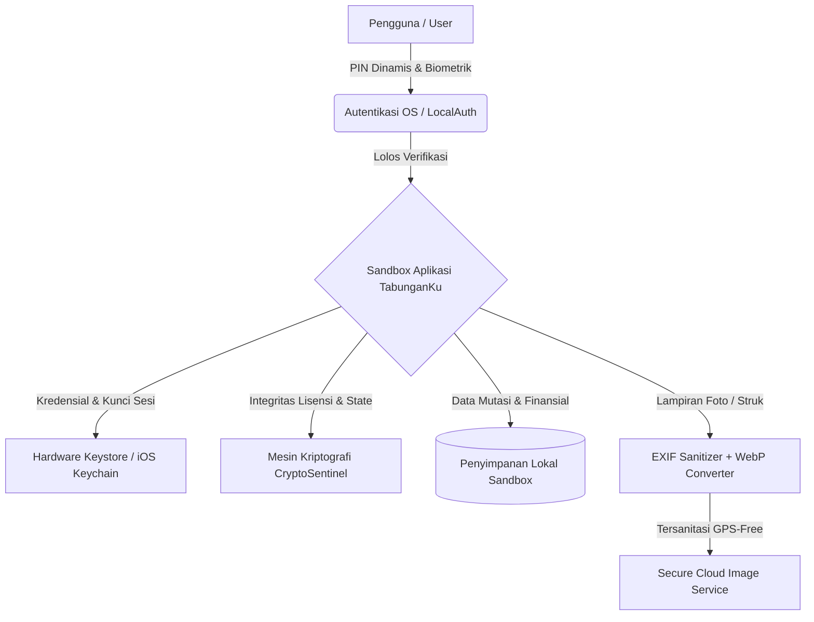

# 🛡️ Kebijakan & Arsitektur Keamanan (Security Policy)

<p align="center">
  
  
  
  
  
</p>

---

## 📑 Daftar Isi

- [🔒 Komitmen Keamanan & Filosofi Privasi](#-komitmen-keamanan--filosofi-privasi)
- [🗓️ Matriks Versi yang Didukung](#️-matriks-versi-yang-didukung)
- [🛡️ 7 Pilar Arsitektur Keamanan TabunganKu](#️-7-pilar-arsitektur-keamanan-tabunganku)
  - [1. Kedaulatan Data Finansial 100% Lokal (Zero-Cloud Leak)](#1-kedaulatan-data-finansial-100-lokal-zero-cloud-leak)
  - [2. Enkripsi Berbasis Perangkat Keras (Hardware-Backed Keystore/Keychain)](#2-enkripsi-berbasis-perangkat-keras-hardware-backed-keystorekeychain)
  - [3. Mesin Kriptografi CryptoSentinel](#3-mesin-kriptografi-cryptosentinel)
  - [4. Autentikasi Ganda: PIN Ergonomis & Biometrik OS](#4-autentikasi-ganda-pin-ergonomis--biometrik-os)
  - [5. Sanitasi Media & Stripping Metadata EXIF/GPS](#5-sanitasi-media--stripping-metadata-exifgps)
  - [6. Keamanan Jaringan & TLS Enforced](#6-keamanan-jaringan--tls-enforced)
  - [7. Ketahanan Anti-Tamper & Anti-Timing Attack](#7-ketahanan-anti-tamper--anti-timing-attack)
- [🔍 Panduan Audit Keamanan Mandiri (Self-Audit)](#-panduan-audit-keamanan-mandiri-self-audit)
- [🚨 Prosedur Pelaporan Celah Keamanan (Vulnerability Disclosure)](#-prosedur-pelaporan-celah-keamanan-vulnerability-disclosure)
  - [Jalur Komunikasi Privat](#jalur-komunikasi-privat)
  - [Format Template Laporan](#format-template-laporan)
  - [Target Waktu Penanganan (SLA)](#target-waktu-penanganan-sla)
  - [Penghargaan & Hall of Fame](#penghargaan--hall-of-fame)
- [💡 Panduan Praktik Terbaik untuk Pengguna](#-panduan-praktik-terbaik-untuk-pengguna)
- [📄 Kontak & Penanggung Jawab](#-kontak--penanggung-jawab)

---

## 🔒 Komitmen Keamanan & Filosofi Privasi

Keamanan dan kerahasiaan data finansial Anda adalah fondasi utama dari pengembangan **TabunganKu**. Kami percaya bahwa aplikasi keuangan pribadi seharusnya **tidak pernah**:
1. Menjual data mutasi kas atau kebiasaan belanja pengguna kepada pihak ketiga/pemasang iklan.
2. Mengirim saldo, pos anggaran, atau data pinjaman ke peladen (*server cloud*) tanpa kontrol pengguna.
3. Menyimpan kredensial rahasia dalam format teks biasa (*plaintext*).

Seluruh arsitektur TabunganKu dibangun dengan prinsip **Privacy by Design** dan **Defense-in-Depth**, di mana keamanan diterapkan pada beberapa lapis terpisah (penyimpanan lokal, memori runtime, otentikasi biometrik, hingga enkripsi media).

---

## 🗓️ Matriks Versi yang Didukung

Kami secara aktif memantau dan merilis pembaruan keamanan, perbaikan bug, dan tambalan (*patch*) untuk versi-versi berikut:

| Versi Rilis | Status Dukungan Keamanan | Catatan Arsitektur |
| :--- | :--- | :--- |
| **v1.5.x** | 🟢 **Didukung Penuh (Sangat Disarankan)** | Dilengkapi mesin `CryptoSentinel`, sandi AES-256-GCM, dan proteksi anti-tamper. |
| **v1.4.x** | 🟡 **Dukungan Terbatas** | Hanya menerima tambalan celah keamanan kritis (*critical security hotfix*). |
| **< v1.4.0** | 🔴 **Tidak Didukung (End-of-Life)** | Pengguna wajib memperbarui aplikasi ke versi terbaru demi keselamatan data. |

---

## 🛡️ 7 Pilar Arsitektur Keamanan TabunganKu

Ekosistem keamanan TabunganKu bertumpu pada 7 pilar proteksi mendalam:



### 1. Kedaulatan Data Finansial 100% Lokal (Zero-Cloud Leak)
* **Penyimpanan Terisolasi**: Seluruh transaksi kas masuk/keluar, target tabungan, catatan hutang-piutang, portofolio emas, dan anggaran bulanan disimpan langsung di dalam penyimpanan lokal perangkat (*app sandbox storage*).
* **Nol Telemetri Finansial**: Tidak ada kode pelacak analitik pihak ketiga (seperti Facebook Pixel atau Google AdMob) yang membaca aktivitas finansial Anda.
* **Bebas Akses Internet untuk Fitur Utama**: Seluruh kalkulator, mutasi kas, grafik, dan pencatatan tabungan dapat berjalan sepenuhnya tanpa sambungan internet.

### 2. Enkripsi Berbasis Perangkat Keras (Hardware-Backed Keystore/Keychain)
Kredensial penting dikelola melalui modul `flutter_secure_storage` yang terikat langsung pada pengolah keamanan perangkat keras:
* **Android**: Memanfaatkan **Android Keystore System** dengan konfigurasi `EncryptedSharedPreferences` (algoritma AES-256 dan pembungkusan kunci privat RSA).
* **iOS**: Memanfaatkan enkripsi **Apple Keychain** dengan status proteksi `KeychainAccessibility.first_unlock`.
* **Resiliensi Data Kunci**: Dilengkapi mekanisme pemulihan ID unik pengguna yang terlindung dari anomali *Keystore wipe* yang terkadang terjadi saat pembaruan OS pada tipe perangkat tertentu.

### 3. Mesin Kriptografi CryptoSentinel
TabunganKu menyematkan pustaka keamanan independen `CryptoSentinel` (`lib/core/security/crypto_sentinel.dart`) yang bertindak sebagai benteng pertahanan runtime:
* **Split-Key XOR Obfuscation**: Kunci master enkripsi tidak disimpan sebagai string biasa di dalam biner aplikasi (mencegah analisis *decompilation* / APK strings reverse-engineering). Kunci direkonstruksi secara dinamis di memori menggunakan kombinasi bitwise XOR dan rotasi pada 4 vektor byte terpisah.
* **Device-Bound Cryptographic Signature**: Lisensi dan integritas data dikaitkan langsung dengan sidik jari perangkat keras (*Device Fingerprint*) yang dibentuk dari entropi aman `Random.secure()` dan karakteristik prosesor/OS.
* **Tanda Tangan Digital HMAC-SHA256**: Setiap status lisensi dan integritas konfigurasi divalidasi dengan enkripsi tanda tangan kriptografis untuk mencegah modifikasi tidak sah (*tampering*).
* **Algorithmic Context Key Derivation**: Kunci eksekusi diturunkan secara algoritmik dari tanda tangan digital yang sah untuk memitigasi serangan manipulasi memori (*memory patching* / hooking berbasis Frida).

### 4. Autentikasi Ganda: PIN Ergonomis & Biometrik OS
* **Papan Tombol PIN Dinamis**: Antarmuka papan tombol PIN numerik (`PinKeypad`) dirancang ergonomis dengan sentuhan getaran (*haptic feedback*). Hash PIN disimpan aman di hardware storage menggunakan algoritma derivasi *one-way cryptographic hash*.
* **Biometrik Terstandarisasi**: Menggunakan API resmi sistem operasi (`local_auth` / *Android BiometricPrompt* & *iOS LocalAuthentication*). TabunganKu **tidak pernah** melihat, mengakses, atau menyimpan data biometrik mentah Anda; otentikasi sidik jari atau Face ID diverifikasi langsung oleh OS Secure Enclave / TEE.
* **Auto-Lock Timeout**: Aplikasi otomatis mengunci layar saat aplikasi diminimalkan (*background*) atau layar perangkat padam untuk melindungi dari akses fisik orang lain.

### 5. Sanitasi Media & Stripping Metadata EXIF/GPS
Saat Anda melampirkan foto struk, nota belanja, atau bukti tabungan:
* **EXIF Stripping Otomatis**: Sistem secara otomatis menghapus metadata gambar sensitif, termasuk **koordinat GPS garis lintang/bujur lokasi pengambilan foto**, jenis kamera, nomor seri lensa, dan waktu jepret perangkat.
* **Kompresi WebP 85%**: Gambar dikonversi ke format WebP berkualitas tinggi dengan ukuran file terkompresi aman di bawah batas 5MB sebelum disimpan atau diunggah.

### 6. Keamanan Jaringan & TLS Enforced
* **Enkripsi Transit Wajib**: Semua komunikasi ke layanan microservice gambar pendukung (`https://api.neverlandstudio.my.id`) diwajibkan menggunakan protokol **TLS 1.2 / TLS 1.3**.
* **Proteksi Replay**: Token otentikasi pertukaran gambar menggunakan enkripsi dinamis satu kali pakai (*single-use replay protection token*).
* **Isolasi Mode Debug**: Pemeriksaan kelonggaran sertifikat jaringan lokal hanya aktif pada kondisi kompilasi debug lokal (`kDebugMode`) dan sepenuhnya dinonaktifkan pada kompilasi rilis produksi.

### 7. Ketahanan Anti-Tamper & Anti-Timing Attack
* **Anti-Timing Attack**: Komparasi tanda tangan kriptografis pada `CryptoSentinel.verifyHmacSignature()` dilakukan dengan perbandingan berwaktu konstan (*constant-time loop* $O(N)$) untuk menggagalkan upaya analisis perbedaan waktu pemrosesan (*side-channel timing attacks*).
* **Anti-Clock Tampering**: Mendeteksi upaya manipulasi waktu perangkat (*clock rollbacks*) dengan melacak tanda waktu tertinggi (*high-water mark epoch*) di penyimpanan aman. Jika waktu sistem dimundurkan lebih dari batas toleransi wajar, sistem akan memblokir aktivasi manipulatif.

---

## 🔍 Panduan Audit Keamanan Mandiri (Self-Audit)

Sebagai bentuk transparansi sumber terbuka, kami mengundang auditor independen dan pengembang untuk memverifikasi keamanan TabunganKu secara langsung di lingkungan lokal:

1. **Audit Statis Kode Sumber**:
   ```bash
   flutter analyze
   ```
2. **Audit Dependensi Pustaka**:
   Periksa seluruh dependensi terdaftar di `pubspec.yaml` dan pastikan tidak terdapat CVE aktif:
   ```bash
   dart pub outdated
   ```
3. **Pemeriksaan Lalu Lintas Jaringan (Zero Data Leak Test)**:
   Gunakan alat inspeksi proxy seperti *Burp Suite*, *mitmproxy*, atau *Charles Proxy* saat menggunakan TabunganKu. Anda dapat membuktikan bahwa **tidak ada paket mutasi kas, saldo, atau identitas Anda yang dikirim keluar**.

---

## 🚨 Prosedur Pelaporan Celah Keamanan (Vulnerability Disclosure)

Jika Anda menemukan potensi celah keamanan, kerentanan logika otentikasi, atau kebocoran data pada TabunganKu, kami meminta Anda untuk bekerja sama secara bertanggung jawab (**Responsible Disclosure**) dan **tidak mempublikasikannya ke ranah publik** sebelum kami berkesempatan merilis perbaikan.

### Jalur Komunikasi Privat
Silakan kirimkan laporan Anda melalui kontak privat berikut:
* 📧 **Email Khusus Keamanan**: [Arlianto032@gmail.com](mailto:Arlianto032@gmail.com)
* 🔒 **GitHub Security Advisory**: Melalui menu *Security* -> *Report a vulnerability* pada repositori resmi TabunganKu.

### Format Template Laporan
Gunakan format subjek email:  
`[SECURITY REPORT] - TabunganKu - <Nama Singkat Kerentanan>`

Mohon sertakan detail berikut:
1. **Deskripsi Ringkas**: Penjelasan sifat celah keamanan dan potensi bahayanya.
2. **Langkah-langkah Reproduksi (Proof of Concept)**: Langkah sistematis agar kami dapat mereproduksi temuan tersebut.
3. **Versi & Lingkungan**: Versi TabunganKu yang diuji, sistem operasi (misal: Android 14 / iOS 17), dan model perangkat.
4. **Usulan Remediasi (Jika Ada)**: Rekomendasi perbaikan kode atau konfigurasi.

### Target Waktu Penanganan (SLA)

| Tahapan | Target Waktu Maksimal | Tindakan Tim Pengembang |
| :--- | :--- | :--- |
| **Tanda Terima** | **< 24 Jam** | Konfirmasi bahwa laporan Anda telah diterima dan masuk antrean peninjauan. |
| **Validasi & Penilaian** | **< 72 Jam** | Verifikasi temuan Proof of Concept dan penentuan tingkat keparahan (CVSS). |
| **Penyusunan Solusi** | **3 - 7 Hari Kerja** | Pembuatan dan pengujian tambalan (*security patch*) pada branch privat. |
| **Rilis Pembaruan** | **Segera** | Peluncuran rilis hotfix ke publik dan pengumuman pembaruan versi. |

### Penghargaan & Hall of Fame
Sebagai wujud apresiasi atas kontribusi Anda dalam menjaga keamanan pengguna TabunganKu:
* Nama dan tautan profil Anda akan dicantumkan secara terhormat di **Changelog Resmi** dan **Hall of Fame Kontributor Keamanan**.
* Mendapatkan lisensi kehormatan VIP Lifetime resmi untuk aplikasi TabunganKu.

---

## 💡 Panduan Praktik Terbaik untuk Pengguna

Meskipun TabunganKu dirancang dengan standar keamanan tinggi, keamanan finansial Anda juga bergantung pada keamanan perangkat fisik Anda:

1. **Gunakan Kunci Layar Sistem**: Selalu aktifkan PIN, pola, atau biometrik pada perangkat Android/iOS Anda.
2. **Aktifkan Kunci PIN TabunganKu**: Buka menu *Pengaturan* -> *Keamanan* -> aktifkan **Kunci Aplikasi** dan pasang PIN 6-digit.
3. **Hindari Menggunakan Perangkat yang Di-Root / Jailbreak**: Perangkat yang telah di-root kehilangan lapisan isolasi sandbox OS, sehingga aplikasi pihak ketiga lain yang berbahaya berpotensi membaca memori perangkat.
4. **Cadangkan Data Secara Teratur**: Lakukan ekspor laporan transaksi ke format PDF atau CSV dan simpan di penyimpanan cadangan pribadi yang aman.
5. **Selalu Gunakan Rilis Resmi**: Pastikan Anda hanya mengunduh aplikasi dari repositori atau rilis resmi pengembang.

---

## 📄 Kontak & Penanggung Jawab

Kebijakan keamanan ini dikelola dan diawasi langsung oleh:

<p align="center">
  <b>Muhammad Isaki Prananda</b><br>
  Lead Developer & Maintainer of TabunganKu<br>
  <i>Berdedikasi untuk solusi teknologi finansial yang tangguh, aman, dan menjaga privasi mutlak pengguna.</i>
</p>

<p align="center">
  <a href="mailto:Arlianto032@gmail.com">
    
  </a>
  <a href="https://github.com/MuhammadIsakiPrananda1">
    
  </a>
</p>
